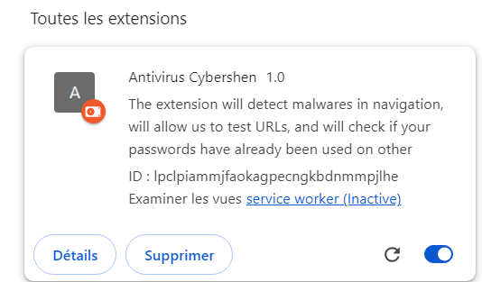
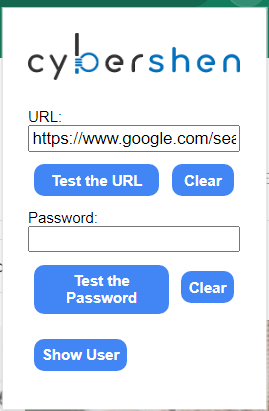

# 2023-PI 
# Version Française

## Comment ajouter l'extension à votre Chrome ?

- Allez sur chrome://extensions
- Activez le mode développeur (en haut à droite)
- Cliquez sur "Charger l'extension non empaquetée"
- Choississez le dossier contenant l'extension (ici le dossier 2023-PI)

Et Voilà ! Vous devriez normalement voir l'extension s'affichez dans la liste de vos extensions

Sur une nouvelle page, vérifiez que vous avez bien accès à l'extension.

# English Version 

## How to add our extension to Chrome ?

- Navigate to chrome://extensions
- Activate Developer mode (top right corner)
- Click on "Load unpacked"
- Select the directory of the extension (here must be 2023-PI)

There you go ! You should now see the extension

In a new page, check if you can access the extension :

